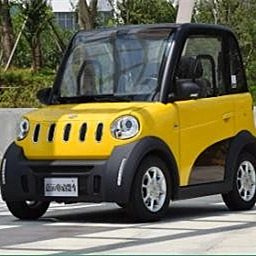

# Vehicles

## Cars

There are different types of cars:

### 1. Hatchback
blah blah blah  
These are made by companies like [Honda](https://www.honda.com.au), [Volkswagon](https://volkswagon.com.au) and blah blah blah


### 2. Sedan
Sedan is a car that looks like this:


## Bicycle
I am a typing text

- this is item 1
- this is item 2
  - this is subitem 1
  - this is subitem 2

> this is a quote from somewhere else

## codes

`hello - one line code`

```
This is
a multi-line
code
```

```py
print("Hello World!")
```

```js
console.log("Hello World!")
```